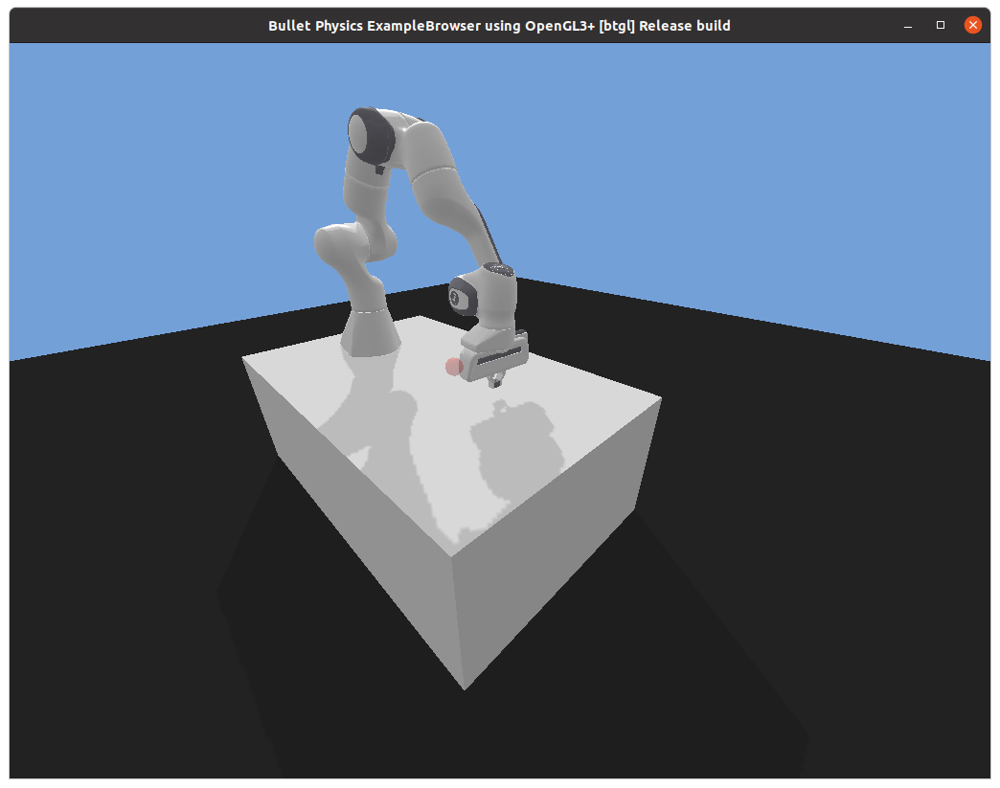
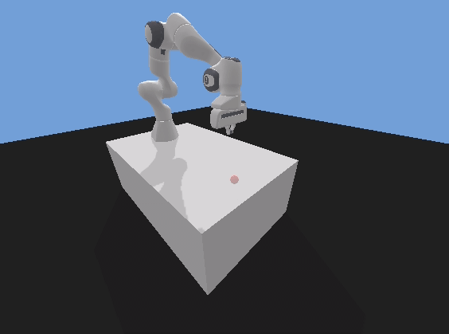
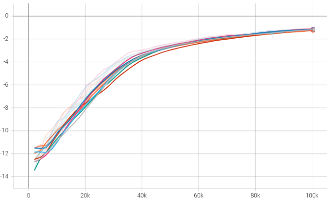
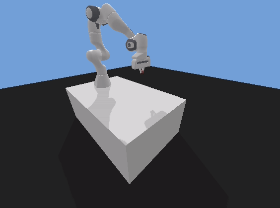
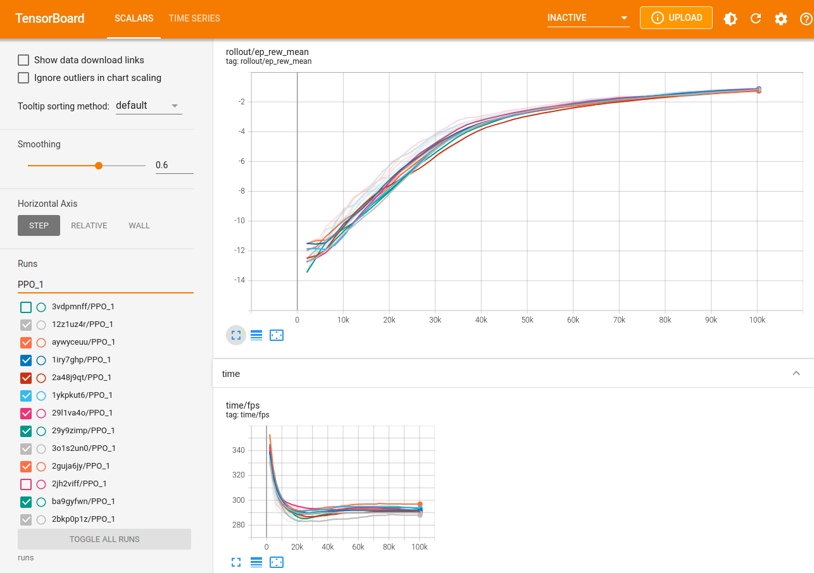
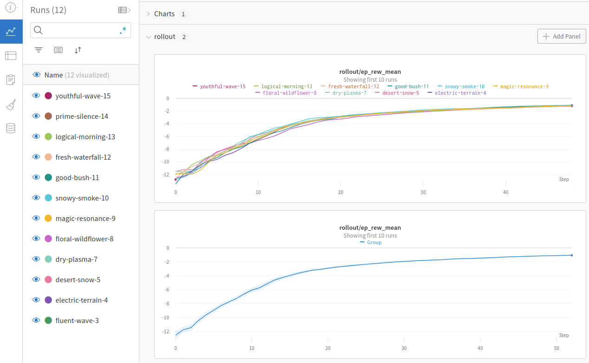

## Reinforcement Learning with the Franka Panda robot pybullet simulation
This is an example showing how to train a Reinforcement Learning agent for the Franka Panda robot arm using:
* [PyBullet](https://github.com/bulletphysics/bullet3) physics simulation
* [Gymnasium (formerly OpenAI gym)](https://gymnasium.farama.org) RL API
* [panda-gym](https://github.com/qgallouedec/panda-gym) robot environments in PyBullet
* [Stable-Baselines3](https://stable-baselines3.readthedocs.io/) RL algorithms library

**Panda pybullet simulation**
<!--  -->



**Episode reward in Tensorboard**


## Reinforcement Learning environment

### Actions
Action space:

The `PandaReach-v3` environment action space is composed of the gripper movement, three coordinates **Box(3)**, one for each axis of movement x, y, z, or joint movement, seven joints **Box(7)**.

ee
```
Box(-1.0, 1.0, (3,), float32)
```

joints
```
Box(-1.0, 1.0, (7,), float32)
```

The action space can be selected by setting `control_type` when creating the environment.

```python
env = gym.make(
    "PandaReach-v3",
    render_mode="human",
    reward_type="dense",  # "dense" or "sparse"
    control_type="ee",  # "ee" or "joints"
)
```

### Observation
Observation space:

The `PandaReach-v3` environment has the following observations, where *observation* is the position and speed of the gripper **Box(6)**.

```
Dict(
    achieved_goal:
        Box(-10.0, 10.0, (3,), float32),
    desired_goal:
        Box(-10.0, 10.0, (3,), float32),
    observation:
        Box(-10.0, 10.0, (6,), float32)
    )
```

### Reward
The `PandaReach-v3` environment comes with both `sparse` and `dense` reward functions. Default is the sparse reward function, which returns 0 or -1 if the *desired goal* was reached within some tolerance. The dense reward function is the negative of the distance *d* between the *desired goal* and the *achieved goal*.

```python
distance_threshold = 0.05  # Distance threshold in meters
d = distance(achieved_goal, desired_goal)  # Norm distance (Euclidean distance)

if self.reward_type == "sparse":
    return -(d > self.distance_threshold).astype(np.float32)
else:
    return -d
```

## Installation

### Create Python 3.8 virtual environment
The python virtual environment is set up with `Python 3.8`. Python 3.7 and up should also work, but has not been tested.

In the following we use Anaconda to set up the virtual environment.

```sh
$ conda create -n rl_panda_gym_py38 python=3.8
$ conda activate rl_panda_gym_py38
```

### Clone repo

```sh
$ git clone https://github.com/simonbogh/rl_panda_gym_pybullet_example.git
```

### Install python packages

We need the following Python packages, which are all defined in `requirements.txt`.

* black==24.2.0
* gym==0.26.2
* gymnasium==0.29.1
* panda-gym==3.0.7
* protobuf==4.25.3
* pybullet==3.2.6
* pyglet==2.0.10
* pygame==2.5.2
* sb3-contrib==2.2.1
* scikit-learn==1.3.2
* stable-baselines3==2.2.1
* tensorboard==2.14.0
* torch==2.2.0
* wandb==0.16.3
* tqdm==4.66.2
* rich==13.7.0

```
$ cd rl_panda_gym_pybullet_example
$ pip install -r requirements.txt
```

## Random agent
The following example tests the installation of `panda_gym` and `pybullet`. It runs the `PandaReach-v3` pybullet environment and sends random actions to the robot.

No Reinforcement Learning agent is trained. Check the next section for how to train an agent using Stable-Baselines3.

```python
import gymnasium as gym
import panda_gym  # Import panda_gym to register the Panda pybullet environments


def run_random_agent():
    # Create gym training environment
    env = gym.make(
        "PandaReach-v3",
        render_mode="human",
        reward_type="dense",  # "dense" or "sparse"
        control_type="ee",  # "ee" or "joints"
    )
    print("Action space:")
    print(env.action_space)
    print("Observation space:")
    print(env.observation_space)

    # Reset environment and get first observation
    obs = env.reset()
    done = False
    while True:
        # Take random action
        action = env.action_space.sample()  # random action
        obs, rewards, dones, truncated, info = env.step(action)
        env.render()  # Make the rendering real-time (1x)

    env.close()


if __name__ == "__main__":
    run_random_agent()
```

## Train PPO agent with Stable-Baselines3
Minimal example showing how to train a PPO agent for the `PandaReach-v3` task using Stable-Baselines3.

```python
import gymnasium as gym
import panda_gym
from stable_baselines3 import PPO

# Create gym training environment
env = gym.make(
    "PandaReach-v3",
    render_mode="human",
    reward_type="dense",  # "dense" or "sparse"
    control_type="ee",  # "ee" or "joints"
)

# Set up PPO model
model = PPO(
    "MultiInputPolicy",
    env,
    verbose=1,
    tensorboard_log="runs",
    learning_rate=0.001,
)

# Train agent
model.learn(total_timesteps=200000)

# Save trained model
model.save("PandaReach_v3_model")
```

The following python script includes more hyper-parameters and settings that can be adapted when training the agent.

```sh
$ python panda_reach_train_agent.py
```


## Test PPO agent
A trained agent/policy can be tested by loading the model saved during training. A trained model can be found in the folder `rl-trained-agents/`.

`panda_reach_test_agent.py` loads a saved model and runs the pybullet simulation using that model as the policy for the agent.

```sh
$ python panda_reach_test_agent.py
```



## Using tensorboard to track training
Tensorboard log files are saved to the `runs/` folder. Make sure to set `tensorboard_log="runs"` for the PPO model before training. When training is running, run the following in your terminal to start tensorboard.

```sh
$ tensorboard --logdir runs
```

Logs can be viewed in a web browser at http://localhost:6006/



## Using wandb to track training
Weights & Biases (wandb) can be used instead of tensorboard to track the training process. Several runs can be compared and you can make reports for the experiments.

https://docs.wandb.ai/guides/integrations/other/stable-baselines-3


## Troubleshooting

### OpenGL / Iris / libstdc issue on laptop with dedicated Nvidia GPU
When running the simulation in an Anaconda environment on a latop with a dedicated Nvidia GPU, you may get an error related to OpenGL, Iris and libstdc.

In this case, change the Nvidia settings to always use the dedicated Nvidia GPU:

1. Open `NVIDIA X server Settings`
1. Select `PRIME Profiles`
1. Select `NVIDIA (Performance Mode)`
1. Restart computer

Source: https://askubuntu.com/questions/1255049/use-dedicated-gpu-only-on-laptop-running-ubuntu-20-04

### Git lfs
Pretrained models are stored using git lfs. Make sure to install git lfs and pull pretrained models.

Ubuntu:

```sh
sudo apt install git-lfs
git lfs install
git lfs pull
```

macOS:

```sh
brew install git-lfs
git lfs install
git lfs pull
```
